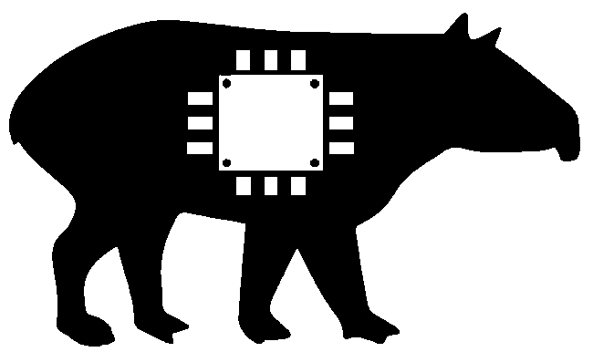
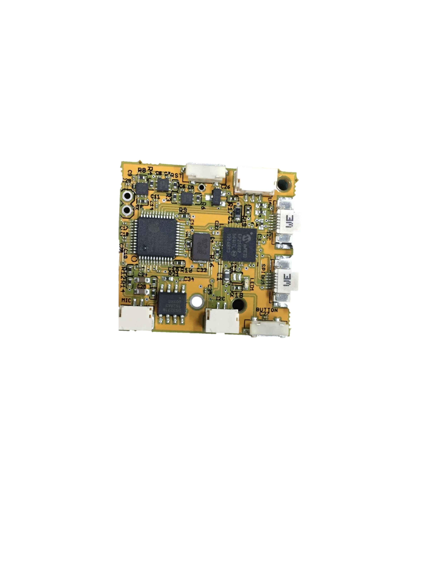
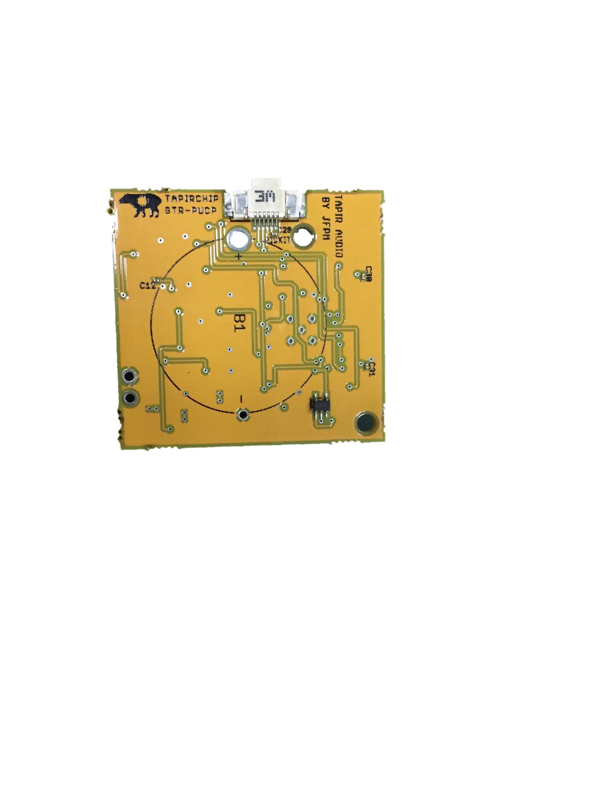

PROJECT TAPIRCHIP 
================================================================

  

INTRODUCTION
===============================================================
The Amazon rainforest is considered to be one of the last natural reserves for animals, plants and trees; untouched by humans. It is also considered to be a frontline in the fight against global warning. 
Illegal mining and uncontrolled deforestation have become a menace to this environment. For this reason, protection and conservation policies must be created by the government. 
In this context biologists are doing their best effort to put into value the amazon rainforest; to show that preserving the amazon can be sustainable economic activity.
The method employed by the biologists consists of doing an animal inventory; done mainly through walking and observation. 
This method is not reliable because animals rarely show their self’s in the presence of humans, besides most of the animals have nightlife activity. 
This makes it difficult to gather information of all the current species of the amazon.
Trap cameras have become a popular method to study wildlife. These devices are attached to a tree and use a motion sensor that is
triggered by the animal's movement to take a picture. These devices have the great advantage that they can work day and night for many
days depending on the energy consumption. They can be installed in remote areas deep in the jungle were humans barely reach.
The information gathered by the traps cameras can help biologist to discover new species, validate the presence of known
species and also study animal bahaviour.

If a transmission system is implemented with the trap camera, the biologists could reduce their walking to the jungle and also monitor the device status. 
In commercial trap cameras the transmission is available through mobile services, but in the jungle the lack of a communication system makes it difficult to use this device. 
Therefore our purpose is to develop a trap camera that meets the biologist’s requirements and that has a communication system to transfer data to a central base.

The project **TAPIRNET** was an effort to implement a trap camera with a 900 MHz wireless radio. 
The results showed that the transmission in the jungle was very difficult due to attenuation from the trees. The trap camera that we propose will have the following advantages:
-	The trap camera will have autonomy to operate for 3 months. This time is fair enough to determine the animal presence.
-	The Camera minimum resolution must be 2 Megapixels; this is desired by biologist to identify correctly animal species.
-	The trap camera will have a wireless radio that can transmit the images to a center node. This will allow biologists to gain access to the pictures without walking and also monitor the camera status.
-	The camera trap will have built-in sensors to capture information from the environment, such as: Temperature, Humidity and Sound.
-	The technology will be developed in our country so technical support will be reachable.

SYSTEM SPECS
===============================================================
This camera trap have the following characteristics:
-	CMOS sensor with a resolution of 5 Megapixeles.
-	2.4 GHz Wi-Fi Radio to have a better throughput.
-	Temperature, humidity and MP3 recorder, to have information about the environment.
-	Li-on Battery for 3 months operation.

CMOS CAMERA
===============================================================
The CMOS camera controller uses a 5 megapixel CMOS sensor from Omnivision, a [FIFO](/docs/AL440B_Dats_Sheets.pdf) memory and a 
processor from Microchip. Since the captured picture data from de CMOS sensor is too big to be stored in the ram memory of the
processor, a FIFO memory of 512 Kbytes is used to store temporally the picture data. 

To recognize the characteristic pattern of animal species, biologists need to zoom into the image; and they have stated that a resolution of 2 megapixels is enough for this purpose. 
The OV5642 CMOS sensor from Omnivision was selected. The previous work to control this sensor found on the web helped in the development of the controller. 
The CMOS sensor outputs pictures with a quality up to 5 Megapixels, which means that the resolution can be set to 2, 3 and 5 Megapixels according to the needs of the biologists. 
Selecting a higher resolution means that picture will occupy more memory which will reduce the amount of pictures that an SD card can store.
The CMOS sensor is controlled with a DSPIC processor selected for its high processing speed (60 MIPS). Besides the CMOS sensor, this processor will control the additional sensors needed to build a trap camera.

2.4GHz Wi-Fi RADIO
================================================================
Transmitting the images to a central node will give biologists access to the pictures without walking to the installation place. 
This can also be used to monitor the trap cameras current state such as: Battery remaining energy, SD card reaming space, CMOS sensor failure, etc. In the previous project 900 MHz radios were employed, the obtained transmission speed was around 30 Kbps. 
To increase the transmission speed the 2.4 GHz frequency was selected.
To transmit the images the ESP8266 Wi-Fi chip is employed. This processor has gain a lot attention for many researches wanting to have a Wi-Fi connection, thus support to use its maximum capacity has been given. 
In this project the “ESP8266 thing dev” board from SPARKFUN was employed. 
Since the cameras traps will work in the jungle were human activity is minimum, the radios will begin to transmit at a specific hour. To achieve this, the DS3231 will alert the nodes to start the transmission. 

AUDIO RECORDER
===============================================================
Visual information of the environment gives a lit of information to the biologist; this can be increased by adding sound. 
For this reason the trap camera will not only take pictures of the animals, additionally a sound recorder is incorporated. To record sound, a microphone (1 channel - MONO) is used to transforms the physical waves into electrical signals. 
This signal is digitalized by an analog to digital converter. Finally this digital data must be converted into a readable format for the computer.
The WAV format is a good option to record sounds into a compatible file for computers. The recorded file has the advantage of not losing its quality during the processing. On the other hand, the file size occupies a significant amount of memory, 50 MB for a 5 minutes stereo recording [10]. For a 4 GB memory approximately 80 files can be saved, this means that if one file is recorded for day, the memory will be full in 80 days, without having pictures.
To manage the file size a compression format is required to save memory. MP3 is a compression format that eliminates the sounds that human ears cannot hear. 
The result is a file that occupies less memory than a WAV file, 3.4 MB for a 5 minutes stereo recording. 
To generate MP3 files; the VS1063a MP3 codec is used. This device includes an analog to digital converter, which allows you to connect a microphone directly.

DESCRIPTION
================================================================
This is an open source project to implement a wireless camera trap that consists of 3 modules: Camera, Audio and WiFi Radio.
This project is to be implemented in the rainforests of PERU, where the Wireless Trap Cameras will have to transmit images from nodes to a sink node over distances of 800 meters
The 3 modules can work independently or in combination accroding to the user needs.
The Camera module consists of a 5MP CMOS sensor from Omnivision which is controlled by a DSPIC processor of the DSPIC33EP family.
For this modules the chosen processor is the DSPIC33EP256GP504.
The Audio module uses the VS1063a audio encoder from VLSI Solution to generated mp3 audio files from the environment, this device is also controlled by a DSPIC processor.
The Radio module core is the ESP8266 SoC chip, this device has a WiFi radio with its RF components and a processor incorporated in one die. This component reduces greatly the pcb size and the support available online makes it easier to implement transmission protocols.
The project has the following  files:
1. CameraTrapCode_OV5642_dsPIC33EP
In this folder we can find all the code to control the OV5642 sensor, as well as its behaviour as a "camera trap".
2. ImageTransmitProtocol_ESP8266
In this folder we can find the transmission protocol to transmit the images taken by the camera module.
To allow the WiFi signal to be transmitted over the trees in the jungle, the antenas will be located on the top of the trees.
For this purpose the nodes will work in 2 configurations. The first folder named "Nodes" will transmitt the pictures from the trap camera located in the ground to the top of the tree.
The second folder named "Network" will transmit images from 4 nodes to a sink node, located on the top of the trees.
3. Mp3Recorder_VS1063
In this folder we can find all the code to record audio in mp3 format using a VS1063 encoder/decoder with a dsPIC33EP processor.